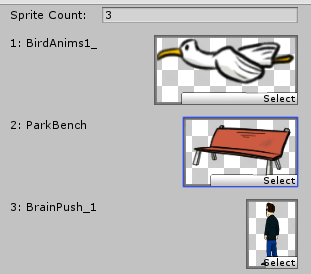

#### EnumObjectPairEditor

Usage

```C#
using System.Collections;
using System.Collections.Generic;
using UnityEngine;
public class MyScript : MonoBehaviour
{
    private enum MyEnum { First, Second, Third }

    [SerializeField] private List<MyEnum> Keys = new List<MyEnum>();
    [SerializeField] private List<Transform> Values = new List<Transform>();
}
```

```C#
using UnityEditor;
using Utils.CustomEditor;
[CustomEditor(typeof(MyScript))]
public class MyScriptEditor : EnumObjectPairEditor
{

}
```


#### SpriteGroup

